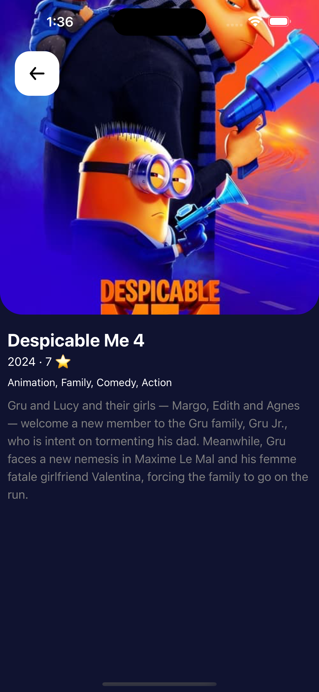
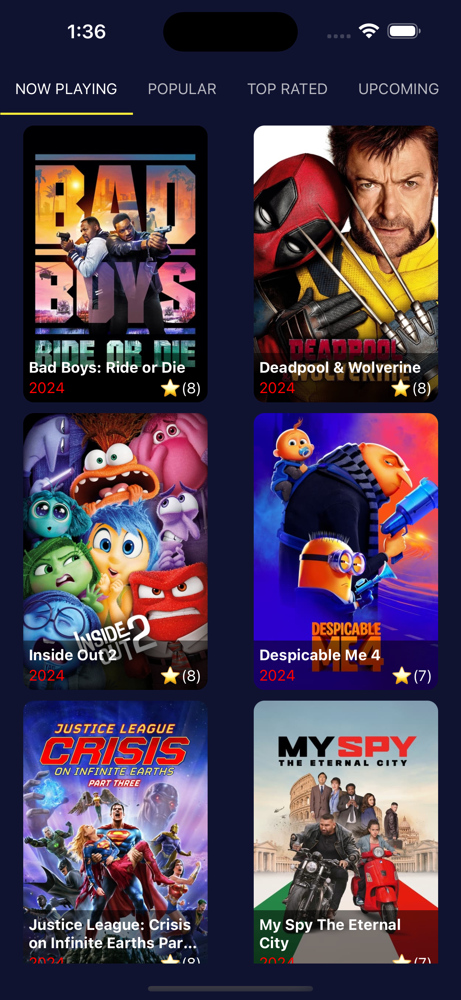

# Movie Demo App

Welcome to the Movie Demo App! This app is built with [Expo](https://expo.dev), utilizing React Query for state management and data fetching, Expo Router for navigation, and Axios for making API requests.

# Screenshots

<div style="display: flex; justify-content: space-around; align-items: center;">
  
  
</div>

### Demo Video

<video width="320" height="240" controls>
  <source src="./screenshot/video.mp4" type="video/mp4">
  Your browser does not support the video tag.
</video>

## Features

- **Data Fetching:** Utilizes Axios to make API requests to the TMDB (The Movie Database) API.
- **State Management:** Manages the application state and caching mechanisms using React Query.
- **Navigation:** Uses Expo Router to handle navigation within the app.

## Prerequisites

Before you begin, ensure you have the following installed:

- Node.js
- npm or yarn
- Expo CLI:
  ```bash
  npm install -g expo-cli
  ```

## Getting Started

Follow these steps to get the app up and running:

### 1. Install Dependencies

Navigate to the project directory and install the required dependencies:

```bash
npm install
```

### 2. Configure API Key

Create a `.env` file in the root of your project directory and add your TMDB API key:

```env
EXPO_PUBLIC_API_KEY=<YOUR_TMDB_KEY>
```

### 3. Start the App

Run the following command to start the Expo development server:

```bash
npx expo start
```
